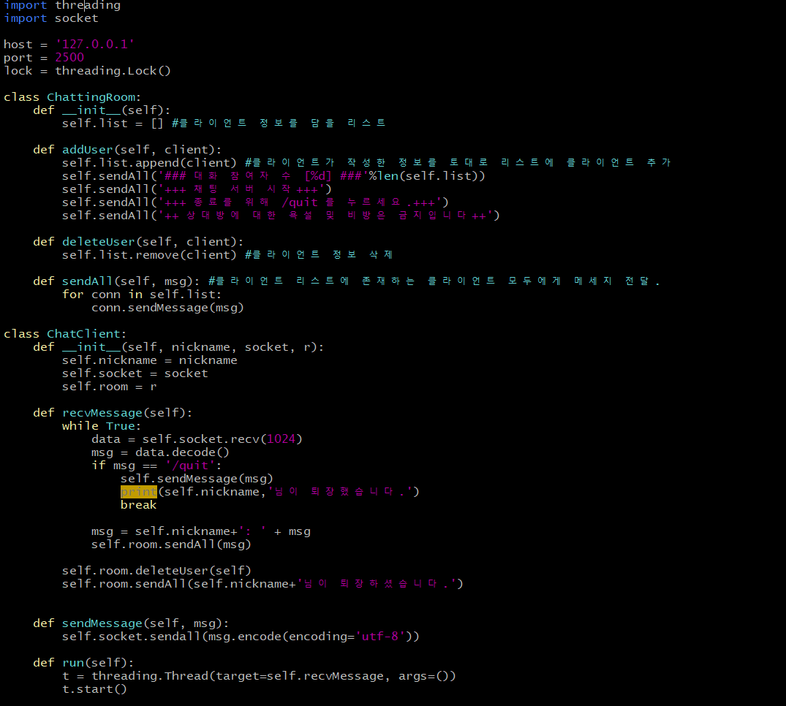
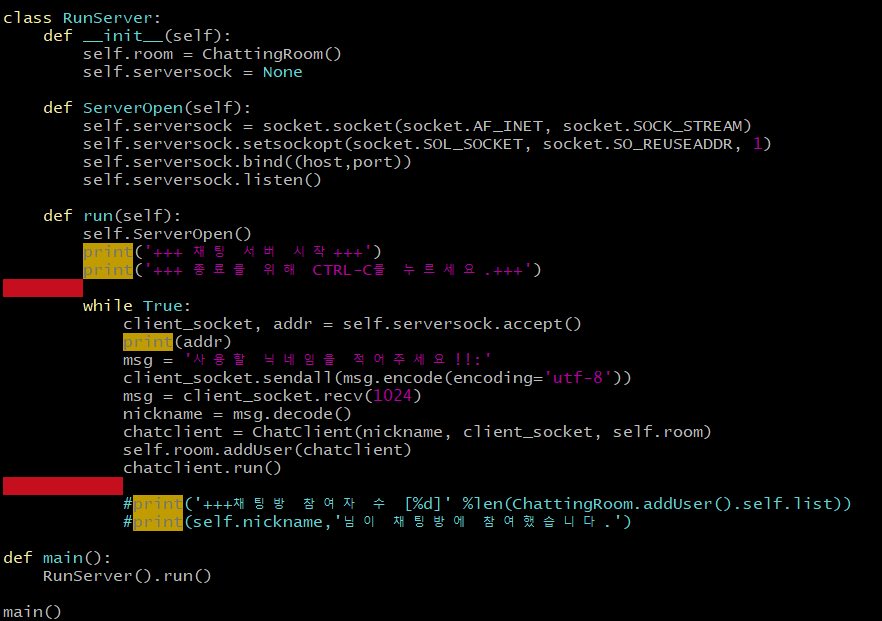
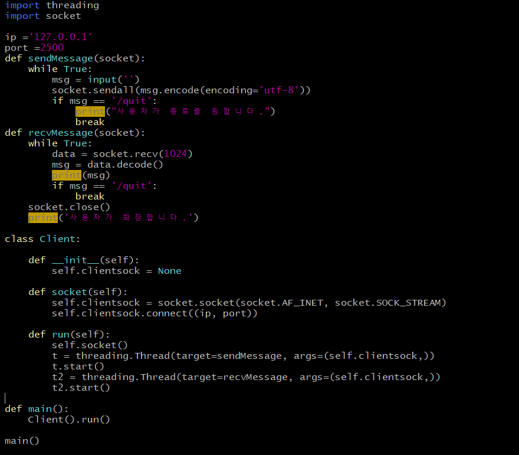

* * *
# 201744020 박지석
* * *
## 기말고사 프로젝트
* * *
### 1. 개요
 네트워크 프로그래밍 분야에서 소켓 프로그래밍은 연결된 네트워크의 양 끝단을 추상화시킨 개념이며,  
 컴퓨터의 관점에서는네트워크로 통하는 컴퓨터의 외부와 컴퓨터 내부의 프로그램을 이어주는 인터페이스이다. 
 소켓 프로그래밍 중 하나인 멀티 프로세스 방식을 이용하여 파이썬을 기반으로 리눅스 환경에서 채팅 프로그램을  
 구현하고자 하였다. 또한 CLI 환경에서 채팅프로그램을 구동하기엔 사용자 편의성 측면으로 제한성이 있기 때문에  
 파이썬 내의 GUI 프로그램인 tkinter을 이용하여 GUI 또한 구현하고자 하였다.
 
 ### 2. 목적
  요즘같은 정보화시대에서 사람과 사람 사이의 정보를 주고 받을 수 있는 채팅 프로그램은 없어서는 안될 필수 요소가 되었다.
  대표적인 예로 카카오톡, 인스타그램 다이렉트 메세지가 있다. 이러한 프로그램들에게서 영감을 받아 기본적인 채팅 기능과 함께
  파일 전송 기능과 닉네임 중복 확인 기능, 채팅 필터링 기능을 포함하여 구현 및 배포가 주 목적이다.
  
 ### 3. 설계 및 기능
  채팅 프로그램은 멀티 쓰레드 방식을 이용하여 여러 사람이 실시간으로 채팅할 수 있도록 구현하였다. 
  **<서버 코드 분석>** 
 </img>
   
   
  ● **class ChattingRoom**  
  => '__init__' 메서드는 이것이 바로 파이썬에서 약속된 메서드 가운데 하나로 초기화(initialize) 메서드이다. 어떤 클래스의 객체가 만들어질 때 
  자동으로 호출되어서 그 객체가 갖게 될 여러 가지 성질을 정해주는 일을 한다. self.list란 클라이언트의 정보를 담을 리스트이다.  
  => addUser(self,client) 메서드에서는 클라이언트에서 입력한 정보를 받아와 self.list에 클라이언트(사용자)를 추가한다. 
  클라이언트가 추가될 때마다 채팅방에 있는 모든 클라이언트(사용자)들에게 현재 채팅방 인원수에 대한 정보를 제공한다.  
  => deleteUser(self,client) 메서드에서는 클라이언트가 채팅방에서 퇴장을 했을 경우 self.list에서 클라이언트에 대한 정보를 모두 삭제한다.  
  => sendAll(self,msg) 메서드에서는 클라이언트가 채팅방에서 작성한 메세지를 리스트에 존재하는 모든 클라이언트(사용자)들에게 모두 뿌려주는 메서드이다.  
   ● **class ChatClient**  
   => 'init' 메서드에서 클라이언트의 닉네임 정보, 소켓 정보를 선언받는다.  
   => recvMessage 메서드에서는 recv 함수를 이용하여 클라이언트 소켓을 거친 최대 크기가 1024인 메세지 정보를 받아 decoding 작업을 우선적으로 진행한다. 만약 클라이언트(사용자)가 보낸 메세지 정보가 '/quit'라면 ChatClient 클래스 안의 sendMessage 메서드를 통해 현재 채팅방 사용자들에게 메세지를 보낸 후 서버와 클라이언트들에게 '/quit' 메세지를 보낸 클라이언트가 퇴장되었다는 알림을 보여준다. '/quit'가 아니라면 클라이언트의 닉네임과 함께 메세지를 함께 채팅방 내의 클라이언트(사용자)들에게 출력해 보여준다.  
   => sendMessage 메서드에서는 클라이언트의 메세지 정보를 받아 encode 작업을 진행 후 모든 사용자들에게 보내는 작업을 한다.  
   => run 메서드에서는 파이썬에서 쓰레드를 실행하기 위해서 threading 모듈의 Thread() 함수를 호출하여 Thread 객체를 얻은 후 Thread  객체의start() 메서드를 호출한다.  
 </img>
  
  
  ● **class RunServer**  
  => ServerOpen 메서드에서 IPv4 체계, TCP 타입 소켓 객체를 생성하고, setsockopt 함수는 포트를 사용 중 일때 에러를 해결하기 위해 선언해준다. 이후 bind 함수를 통해 ip주소와 port 번호를 함께 socket에 바인드하고, listen 함수는 서버가 클라이언트의 접속을 얼마나 허용할 것인지에 대해 선언한다.  
  => run 메서드에서는 채팅 서버 시작과 클라이언트들에게 
  **<클라이언트 코드 분석>** 
  </img>
 ### 4. 구현 실패 이유
 
